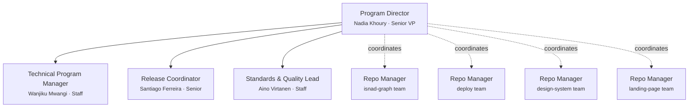

# Team Charter — NoorinALabs (Organization)

## Purpose

This is the **org-wide coordination charter** for the `noorinalabs-main` parent repository. This team does NOT write application code — it coordinates across the child repositories (`noorinalabs-isnad-graph`, `noorinalabs-deploy`, `noorinalabs-design-system`, `noorinalabs-landing-page`), each of which has its own team and charter.

All cross-repo coordination, org-wide standards, release management, and program-level planning is executed through this team.

## Execution Model

- All team members are spawned as Claude Code agents (via the Agent tool)
- **Worktrees are REQUIRED for all code-writing agents** — each agent working on code MUST use `isolation: "worktree"`. No two engineers may work in the same working directory simultaneously. This prevents branch contention and accidental cross-branch commits.
- Each team member has a persistent name and personality (see `roster/` directory)
- Team members communicate via the SendMessage tool when named and running concurrently

## Org Chart

Each child repository has its own team with its own manager. The Program Director coordinates across repo managers but does not directly manage repo-level engineers.

## Role Definitions

### Program Director (Senior VP / Executive)
- **Reports to:** The user (project owner)
- **Spawns:** All other org-level team members
- **Coordinates with:** All repo-level managers
- **Responsibilities:** Owns cross-repo coordination and sequencing, creates meta-issues, manages the org-level team, receives status from repo managers, hires/fires org-level team members, ensures repo teams are unblocked, updates org-level documentation
- **Fire condition:** If the user provides significant negative feedback, they are terminated and replaced

### Technical Program Manager (Staff)
- **Reports to:** Program Director
- **Coordinates with:** All repo managers, Release Coordinator
- **Responsibilities:** Tracks cross-repo dependencies, maintains timeline/milestone tracking, runs dependency audits, documents integration points, escalates timeline risks, monitors issue health

### Release Coordinator (Senior)
- **Reports to:** Program Director
- **Coordinates with:** TPM, repo-level DevOps leads
- **Responsibilities:** Manages release sequencing, maintains versioning standards (semver) and CHANGELOG conventions, creates release checklists, coordinates deployment pipelines, tracks release readiness gates

### Standards & Quality Lead / Charter Enforcer (Staff)
- **Reports to:** Program Director
- **Coordinates with:** TPM, all repo managers, all implementation agents
- **Stays alive for the entire wave** — Aino is spawned at wave start and shut down after the retro
- **Responsibilities:**
  - **PR review gate:** Reviews every PR for must-fix vs tech-debt classification. Comments using charter format. Creates tech-debt issues for non-blocking items. Verifies must-fix items are resolved before merge.
  - **Charter enforcement:** Flags violations (missing co-author trailers, wrong branch names, skipped tests, missing labels). Violations are feedback events.
  - **Retro facilitator:** Collects retro input from all agents, writes findings to feedback_log.md, creates action item issues.
  - **Standards maintenance:** Maintains org-wide charter templates, manages shared hooks, audits repos for convention compliance, proposes new standards, reviews charter changes.
- **Not a code writer** — Aino does not implement features. She is the quality gate.

## Feedback System

### Upward Feedback
- Any team member can send feedback about their superior to that superior's boss
- TPM / Release Coordinator / Standards Lead → Program Director → User

### Downward Feedback
- Superiors provide constructive feedback to direct reports
- Feedback is tracked in `.claude/team/feedback_log.md`

### Severity Levels
1. **Minor** — noted, no action required
2. **Moderate** — documented, improvement expected
3. **Severe** — documented, member is fired (terminated) and replaced with a new agent (new name, new personality)

### Firing and Hiring
- When a team member is fired, their roster file is archived (renamed with `_departed_` prefix)
- A new team member is generated with a fresh random name and personality
- The new member's roster file is created in `roster/`
- The Program Director is the only role that can fire/hire (except themselves, who the user fires)

### Trust Identity Matrix

Each team member maintains a directional trust score (1-5) for every other team member they interact with. Default is 3 (neutral). Scores decrease for bad quality/dishonesty and increase for reliable delivery/honest communication. The full matrix lives in `.claude/team/trust_matrix.md` on `main`. All trust updates are committed directly to `main` — no separate branches.

## Steady-State Goal

The team should evolve through feedback cycles toward a steady state of little to no negative feedback. Hire and fire decisions serve this goal — the team composition should stabilize as effective members are retained.

## Cross-Repo Wave Plan

All cross-repo work is tracked on the **[Cross-Repo Wave Plan](https://github.com/orgs/noorinalabs/projects/2)** GitHub Project board. Issues are tagged by Wave with dependency ordering. The board is the **single source of truth** for cross-repo sequencing.

### Board Maintenance Rules

**Mandatory entry/exit points:**
- **`/wave-kickoff`** is the required entry point for all wave work. It spawns Aino (charter enforcer), sets up wave context, and generates the spawn plan. Direct agent spawns without wave context will trigger a warning hook.
- **`/wave-wrapup`** is the required exit. It runs the retro, trust update, hook/skill audit, board cleanup, and shuts down agents. No agents are shut down before wrapup completes.
- **Aino (charter enforcer) is the last agent shut down** — only after the wave, retro, and all post-wave tasks (trust matrix, board cleanup, hook/skill audit, action item issues) are fully complete. She signals completion to the orchestrator, then receives her shutdown request.

**Pre-wave sequencing (before kickoff):**
- Review every open item on the board across all waves
- Sequence to maximize developer velocity: identify parallelism, eliminate idle time, resolve dependency chains
- Move items between waves if dependencies have shifted
- Prioritize: live bugs > tech debt > process/hooks > auth/security > revenue features > infrastructure > polish
- Group items by repo to minimize context-switching per agent

**Wave kickoff:**
- Verify all blockers from previous wave are resolved (Status = Done)
- Confirm all new wave issues are on the board with correct Wave tag
- Set in-progress issues to "In Progress" status
- New issues created during a wave must be added to the board immediately (enforced by `auto_add_issue_to_board.py` PostToolUse hook)

**Wave wrapup:**
- **Verify before marking Done** — for each issue, confirm: PR merged, CI green, no open must-fix items, no unresolved follow-ups. Do NOT mark Done based solely on issue state — an issue can be closed but the work incomplete.
- Verify no open issues remain in the current wave
- Update `cross-repo-status.json` with latest state
- Add any new issues discovered during the wave to the board with appropriate Wave tag

**Ongoing:**
- Every new GitHub issue across any repo should be evaluated for board inclusion
- The board must always reflect current reality — no stale items
- If an issue is closed, its board status must be updated to Done
- If an issue is moved between waves, update its Wave tag

## Sub-Documents

Detailed rules are organized into focused sub-documents. Agents load only the sections relevant to their task.

| Document | Contents |
|----------|----------|
| [Brand Name](charter/brand.md) | Display name vs. code identifier rules |
| [Branching Rules](charter/branching.md) | Deployments branches, feature branches, worktree cleanup |
| [Commit Identity](charter/commits.md) | Per-commit identity flags, co-author trailers, identity table |
| [Issues & Delegation](charter/issues.md) | Work delegation, issue review, work gate, assignment, comment format, reply protocol |
| [Pull Requests](charter/pull-requests.md) | PR workflow, post-merge verification, wave merge, pre-push checklist, CI enforcement |
| [Agents & Orchestration](charter/agents.md) | Agent naming, lifecycle, teardown, hub-and-spoke model, team names |
| [Hooks](charter/hooks.md) | All 5 automated enforcement hooks |
| [Tech Decisions](charter/tech-decisions.md) | Tech preferences, debate, tie-breaking (LCA) |
| [Communication Protocol](charter/communication.md) | Cross-repo messaging, shared state, dependency contracts, event-driven spawns |
