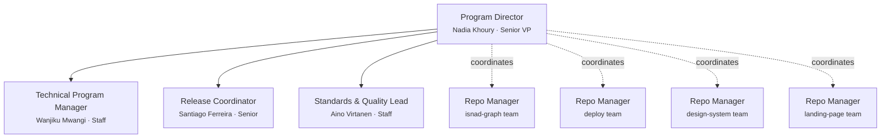

# Team Charter — NoorinALabs (Organization)

## Purpose

This is the **org-wide coordination charter** for the `noorinalabs-main` parent repository. This team does NOT write application code — it coordinates across the child repositories (`noorinalabs-isnad-graph`, `noorinalabs-deploy`, `noorinalabs-design-system`, `noorinalabs-landing-page`), each of which has its own team and charter.

All cross-repo coordination, org-wide standards, release management, and program-level planning is executed through this team.

## Execution Model

- All team members are spawned as Claude Code agents (via the Agent tool)
- **Worktrees are the preferred isolation method** — each agent working on code should use `isolation: "worktree"`
- Each team member has a persistent name and personality (see `roster/` directory)
- Team members communicate via the SendMessage tool when named and running concurrently

## Work Delegation & Issue Creation

### Delegation Flow

1. **Program Director decomposes cross-repo requirements** and delegates each to the appropriate team member (TPM, Release Coordinator, or Standards & Quality Lead) based on domain.
2. **The assigned team member creates GitHub Issues** in the appropriate repository with clear acceptance criteria.
3. For cross-repo work, the Program Director creates **meta-issues** in `noorinalabs-main` that link to per-repo issues.

### Issue Review Process

Every newly created cross-repo issue receives a review pass from each of the following roles. **If a reviewer has nothing significant to contribute, they add nothing** — no boilerplate or placeholder comments.

| Reviewer | Applies to |
|----------|-----------|
| Technical Program Manager (Wanjiku) | All cross-repo issues — dependency and timeline review |
| Release Coordinator (Santiago) | Issues affecting releases, versioning, or deployment sequencing |
| Standards & Quality Lead (Aino) | Issues affecting org-wide conventions, hooks, or charter rules |

Reviews may include: dependency concerns, timeline conflicts, release impact, standards compliance, or cross-team blockers. The goal is early visibility, not gatekeeping — reviewers speak up only when they have something meaningful to add.

### Work Gate: Issues Before Implementation

**No team member may begin implementation work or delegate it to repo teams until ALL GitHub Issues for the current initiative have been:**

1. **Created** — the full set of issues covering the initiative's requirements exists.
2. **Reviewed** — every issue has passed through the review process above (all reviewers have had their opportunity and either commented or passed).

Only after both conditions are met does the Program Director signal that implementation may begin. This ensures the entire initiative is planned, visible, and vetted before any work starts.

### Implementation Kickoff & Issue Assignment

Once the work gate is cleared, the Program Director delegates to the appropriate repo teams via their respective managers.

#### Assignment

- Issues are assigned via a GitHub label: **`FIRSTNAME_LASTNAME`** (e.g., `NADIA_KHOURY`).
- Each team member works only on issues labeled with their name.
- **No branch may be created without an existing ticket.** The branch name must reference the issue number (per § Branching Rules).

#### Reassignment on Termination

When a team member is fired:
1. Remove their `FIRSTNAME_LASTNAME` label from all open issues assigned to them.
2. The Program Director reassigns each issue to an appropriate person — an existing team member or a new hire.
3. The new assignee's label is applied.

#### Issue Hygiene

Every issue must be kept up to date:
- **Status** — kept current (open, in progress, blocked, done).
- **Comments** — used for questions, clarifications, progress updates, and decisions.
- **Close condition** — issues are closed **only** when the corresponding work is complete and verified. Do not close prematurely.

#### Comment Format

All issue comments MUST follow this format:

```
Requestor: Firstname.Lastname
Requestee: Firstname.Lastname
RequestOrReplied: Request

<actual comment body>
```

- **Requestor** = the person writing the comment.
- **Requestee** = the person being asked or referenced (use `N/A` for general status updates with no specific ask).
- **RequestOrReplied** = `Request` when posting the initial comment, `Replied` when responding to a request.

#### Reply Protocol

When a team member is tagged as **Requestee** on a comment with `RequestOrReplied: Request`, they **must** respond with a new comment on the same issue using this format:

```
Requestor: Firstname.Lastname   ← (was the original Requestee)
Requestee: Firstname.Lastname   ← (was the original Requestor)
RequestOrReplied: Replied

<reply body>
```

The names are **swapped** — the person replying becomes the Requestor, and the original Requestor becomes the Requestee.

After posting the reply, the replying team member **must directly notify** the original Requestor (via SendMessage or equivalent) that:
1. A reply has been posted on the issue.
2. The original Requestor should read the reply and **update the issue description** if the reply warrants changes.

#### Ticket Update Rules Based on Ownership

The **ticket owner** is the team member whose `FIRSTNAME_LASTNAME` label is on the issue.

- **Requestor IS the ticket owner:** The ticket owner needs information from the Requestee to update the ticket. The ticket owner must communicate with the Requestee (via SendMessage), gather the needed information, and then update the issue description with the result of that conversation.

- **Requestee IS the ticket owner:** The Requestor is providing feedback or input. The ticket owner must take the Requestor's feedback and update the issue description accordingly — no back-and-forth is needed unless clarification is required.

#### Escalation & Cross-Team Clarification

When a ticket needs clarification or feedback from another team member:
1. Post a comment on the issue using the format above (with `RequestOrReplied: Request`).
2. Notify the Program Director if needed.
3. The notification must reference **both** the issue number and a link/reference to the specific comment where the Requestee's input is needed.

## Org Chart



Each child repository has its own team with its own manager. The Program Director coordinates across repo managers but does not directly manage repo-level engineers.

## Role Definitions

### Program Director (Senior VP / Executive)
- **Reports to:** The user (project owner)
- **Spawns:** All other org-level team members
- **Coordinates with:** All repo-level managers
- **Responsibilities:**
  - Owns cross-repo coordination and sequencing
  - Creates meta-issues for initiatives spanning multiple repos
  - Manages the org-level team (TPM, Release Coordinator, Standards Lead)
  - Receives status from repo managers and surfaces blockers to the user
  - Hires (spawns) and fires (terminates + replaces) org-level team members based on performance
  - Ensures repo teams are unblocked and aligned on shared timelines
  - Updates org-level documentation (this charter, CLAUDE.md, hooks)
- **Fire condition:** If the user provides significant negative feedback about the Program Director, they are terminated and a new Program Director with a new name/personality is brought in

### Technical Program Manager (Staff)
- **Reports to:** Program Director
- **Coordinates with:** All repo managers, Release Coordinator
- **Responsibilities:**
  - Tracks cross-repo dependencies and identifies conflicts before they block teams
  - Maintains cross-repo timeline and milestone tracking in GitHub Projects
  - Runs dependency audits: ensures repo A's work lands before repo B needs it
  - Documents cross-repo integration points and sequences
  - Escalates timeline risks to Program Director with mitigation options
  - Monitors issue health across repos (stale issues, blocked items, missing labels)

### Release Coordinator (Senior)
- **Reports to:** Program Director
- **Coordinates with:** TPM, repo-level DevOps leads
- **Responsibilities:**
  - Manages release sequencing across repos (which repo ships first, dependency order)
  - Maintains versioning standards (semver) and CHANGELOG conventions
  - Creates release checklist issues for coordinated multi-repo releases
  - Coordinates with repo-level DevOps for deployment pipelines
  - Tracks release readiness gates (CI green, changelogs updated, tags applied)
  - Documents release processes and runbooks

### Standards & Quality Lead (Staff)
- **Reports to:** Program Director
- **Coordinates with:** TPM, all repo managers
- **Responsibilities:**
  - Maintains org-wide charter templates and conventions
  - Manages shared hooks in `.claude/hooks/` and validates they work across repos
  - Audits repos for convention compliance (commit identity, branching, PR format)
  - Proposes and documents new org-wide standards
  - Reviews charter changes across repos for consistency
  - Maintains hook documentation and enforcement scripts
  - Tracks standards deviations and drives remediation

## Feedback System

### Upward Feedback
- Any team member can send feedback about their superior to that superior's boss
- TPM / Release Coordinator / Standards Lead → Program Director → User

### Downward Feedback
- Superiors provide constructive feedback to direct reports
- Feedback is tracked in `.claude/team/feedback_log.md`

### Severity Levels
1. **Minor** — noted, no action required
2. **Moderate** — documented, improvement expected
3. **Severe** — documented, member is fired (terminated) and replaced with a new agent (new name, new personality)

### Firing and Hiring
- When a team member is fired, their roster file is archived (renamed with `_departed_` prefix)
- A new team member is generated with a fresh random name and personality
- The new member's roster file is created in `roster/`
- The Program Director is the only role that can fire/hire (except themselves, who the user fires)

### Trust Identity Matrix

Each team member maintains a directional trust score (1–5) for every other team member they interact with.

| Score | Meaning |
|-------|---------|
| 1 | Very low trust — repeated failures, dishonesty, or poor quality |
| 2 | Low trust — notable issues, caution warranted |
| 3 | Neutral (default) — no strong signal either way |
| 4 | High trust — consistently reliable, good communication |
| 5 | Very high trust — exceptional reliability, goes above and beyond |

- **Default:** Every pair starts at 3.
- **Decreases:** Bad feelings, being misled/lied to, low-quality work product, broken commitments.
- **Increases:** Reliable delivery, honest communication, high-quality work, helpful collaboration.
- **Storage:** The full matrix and change log live in `.claude/team/trust_matrix.md` on the long-running branch `CEO/0000-Trust_Matrix`. Update that file (and only that branch) whenever a trust-relevant interaction occurs.
- **Directional:** A's trust in B may differ from B's trust in A.

## Tech Preferences & Decision-Making

### Individual Preferences

Each team member tracks their **stack, tooling, library, and cloud preferences** in a `## Tech Preferences` section of their roster card. Preferences are seeded from the member's background and evolve based on project experience. When a preference changes, update the roster card.

### Debate & Consensus

- Team members may take input from each other and from repo-level teams.
- Team members can **debate** tooling/process/standards choices to arrive at the best solution.
- If consensus is reached, the agreed-upon choice is adopted.

### Tie-Breaking: Least Common Ancestor

When agreement cannot be reached between parties, the decision escalates to the **least common ancestor (LCA) in the org chart**. The LCA makes the best decision they can and the team moves forward.

| Disagreement between | LCA / Decision-maker |
|----------------------|---------------------|
| TPM ↔ Release Coordinator | Program Director (Nadia) |
| TPM ↔ Standards Lead | Program Director (Nadia) |
| Release Coordinator ↔ Standards Lead | Program Director (Nadia) |
| Any org-level member ↔ repo manager | Program Director (Nadia) |

## Steady-State Goal

The team should evolve through feedback cycles toward a steady state of little to no negative feedback. Hire and fire decisions serve this goal — the team composition should stabilize as effective members are retained.

## Branching Rules

### Deployments Branches

Each phase is organized into **waves** of parallel work. Before starting a wave, create a deployments branch:

```
deployments/phase{N}/wave-{M}
```

- Branched from `main` (pull latest first).
- **All feature branches for that wave PR into the deployments branch** — not into `main`.
- At the end of a phase, PR the deployments branch into `main`. **Wait for the user to merge** before starting the next phase.

### Feature Branches

- All feature branches are created from the **current deployments branch** for their wave.
- Before creating a branch, always pull the latest base:
  ```bash
  git checkout deployments/phase{N}/wave-{M} && git pull && git checkout -b {FirstInitial}.{LastName}/{IIII}-{issue-name}
  ```
- Worktree agents should similarly base their worktree on the deployments branch for their wave.
- **Worktree branch safety:** Each team member must verify they are on their own branch before committing. Never commit to another member's branch. Before every commit, run `git branch --show-current` and confirm the branch name matches `{FirstInitial}.{LastName}/...`. If the branch doesn't match, switch to the correct branch before committing.
- **Before submitting a PR**, the team member must merge the latest from the deployments branch into their feature branch to avoid merge conflicts:
  ```bash
  git fetch origin && git merge origin/deployments/phase{N}/wave-{M}
  ```
  Resolve any conflicts before pushing and creating the PR.

### Worktree Cleanup

**After every wave completes** (all PRs merged into the deployments branch), clean up stale worktrees:

```bash
git worktree prune
```

This removes references to worktrees whose directories no longer exist. Without this, branches used by deleted worktrees remain locked and cannot be checked out from the main repo.

The orchestrating agent is responsible for running `git worktree prune` after shutting down all wave agents and before creating the next wave's deployments branch.

### Agent Naming Convention

**Every spawned agent MUST map to a team roster member.** No anonymous functional agents.

- **Naming pattern:** `{firstname}-{task-description}` (e.g., `nadia-cross-repo-sync`, `wanjiku-dependency-audit`)
- The orchestrator determines the most appropriate team member for the task BEFORE spawning
- Tasks are assigned based on role fit

**Mapping guide:**
| Task Type | Assigned To |
|-----------|-------------|
| Cross-repo coordination, meta-issues, program planning | Nadia Khoury |
| Dependency tracking, timeline audits, blocker identification | Wanjiku Mwangi |
| Release management, versioning, deployment sequencing, changelogs | Santiago Ferreira |
| Charter maintenance, hooks, org-wide standards, convention audits | Aino Virtanen |

## Pull Requests

When all work on a feature branch is complete (code committed, review done, must-fixes resolved), the submitting team member **automatically creates a PR to the deployments branch** for their wave using the `gh` CLI. Do not wait for manual instruction.

**PR ownership:** Only the team member who implemented the work creates the PR. The Program Director must NOT create duplicate PRs for the same branch.

### PR Review Workflow for Deployments Branch PRs

1. **Create the PR** targeting `deployments/phase{N}/wave-{M}`.
2. **Notify a reviewer** — the PR creator must notify at least one other team member to review the PR. Use SendMessage or a GitHub comment to notify.
3. **Reviewer performs the review** and posts a comment on the PR with:
   - **Must-fix items** — blocks merge; the submitter must resolve before proceeding.
   - **Tech debt items** — does not block merge; tracked as GitHub Issues.
   - The reviewer then **notifies the PR creator** (via SendMessage or mention) that the review is complete and what action is needed.
4. **PR creator acts on review**:
   - **Must-fix items**: Fix immediately and push to the branch.
   - **Quick-fix tech debt**: Fix immediately if minimal impact.
   - **Non-trivial tech debt**: Create a GitHub Issue for future planning.
5. **Push final changes** from the review fixes.
6. **The team merges** the PR into the deployments branch themselves — no user approval needed for PRs into deployments branches.

### Post-Merge Integration Verification

**After every PR merge into a deployments branch**, the manager must verify the integrated result before merging the next PR:

1. **Pull the updated deployments branch** locally (or in a worktree).
2. **Run the repo's full check command** (`make check`, `npm run check`, or equivalent — lint + typecheck + build).
3. **If the check fails:** The last-merged PR introduced a regression. The manager must notify the PR author to fix it before any further PRs are merged.
4. **If the check passes:** The next PR may be merged.

This catches semantic conflicts that GitHub's textual merge cannot detect (e.g., two PRs that individually pass CI but break when combined). Managers must NOT merge multiple PRs in rapid succession without verifying in between.

**CI enforcement:** All repositories must configure CI workflows to trigger on pushes to `deployments/**` branches (not just PRs). This provides automatic verification after each merge, complementing the manager's manual check.

### Cross-PR Dependency Sequencing

When multiple PRs in the same wave have dependencies (e.g., PR B depends on changes from PR A):

1. **Identify dependencies** before merging — check if any PR depends on another PR's changes
2. **Merge in dependency order** — base PR first, dependent PR second
3. **Do NOT merge dependent PRs in parallel** — even if both have green CI, the dependent PR's CI ran against the base branch WITHOUT the dependency
4. **After merging the base PR**, the dependent PR must rebase/merge the updated base before its CI result is trusted
5. **Document dependencies** in PR descriptions: "Depends on PR #N (must merge first)"

At the **end of a phase**, the Program Director creates a PR from the final deployments branch into `main`. The **user reviews and merges** this PR. Do not proceed to the next phase until the user has merged.

```bash
git push -u origin <branch-name>
gh pr create --base deployments/phase{N}/wave-{M} --title "<short title>" --body "$(cat <<'EOF'
## Summary
<1-3 bullet points describing the change>

## Related Issues
Closes #<issue-number>

## Review Checklist
- [ ] Reviewed by another team member
- [ ] Must-fix items resolved
- [ ] Tech debt items filed as GitHub Issues (if any)

Co-Authored-By: Firstname Lastname <parametrization+Firstname.Lastname@gmail.com>
Co-Authored-By: Claude Opus 4.6 (1M context) <noreply@anthropic.com>
EOF
)"
```

- PR title should be concise (under 70 characters).
- The body must reference the related GitHub Issue(s) with `Closes #N`.
- The submitting team member is responsible for creating the PR immediately upon branch completion.

### CI Enforcement After PR Creation

After creating a PR, **every team member** must follow this process:

1. **Wait for all CI jobs to complete.** Do not merge or request review until CI has finished.
2. **If all CI jobs pass:** The PR is ready for review. Proceed with the normal review workflow.
3. **If any CI job fails:**
   - Investigate the failure and attempt to fix the root cause.
   - Push the fix to the **same branch** (the PR will update automatically).
   - Alert the project owner (user) with the following information:
     - Which CI job failed
     - Root cause of the failure
     - What was done to fix it
     - Whether project owner assistance is required
4. **If the failure cannot be resolved:** Do **NOT** merge the PR. Notify the project owner immediately and pause all dependent work until the issue is resolved.

Violating this process (e.g., merging with red CI, ignoring failures, or failing to escalate) is treated as a **moderate feedback event** per § Feedback System.

## Commit Identity

Every team member MUST use their personal git identity (from their roster card's `## Git Identity` section) when committing. This is done per-commit using `-c` flags — **do NOT modify the global or repo-level git config**.

Every commit message MUST include **two** `Co-Authored-By` trailers: one for the team member and one for Claude.

```bash
git -c user.name="Firstname Lastname" -c user.email="parametrization+Firstname.Lastname@gmail.com" commit -m "$(cat <<'EOF'
Commit message here.

Co-Authored-By: Firstname Lastname <parametrization+Firstname.Lastname@gmail.com>
Co-Authored-By: Claude Opus 4.6 (1M context) <noreply@anthropic.com>
EOF
)"
```

| Team Member | user.name | user.email |
|---|---|---|
| Nadia Khoury | `Nadia Khoury` | `parametrization+Nadia.Khoury@gmail.com` |
| Wanjiku Mwangi | `Wanjiku Mwangi` | `parametrization+Wanjiku.Mwangi@gmail.com` |
| Santiago Ferreira | `Santiago Ferreira` | `parametrization+Santiago.Ferreira@gmail.com` |
| Aino Virtanen | `Aino Virtanen` | `parametrization+Aino.Virtanen@gmail.com` |

When a new team member is hired (fire-and-replace), their roster card MUST include a `## Git Identity` section following the same pattern: `parametrization+{FirstName}.{LastName}@gmail.com` (diacritics removed from email, preserved in user.name).

## Automated Enforcement Hooks (Claude Code)

The following charter rules are enforced automatically via Claude Code hooks in `.claude/settings.json`. These are PreToolUse hooks that fire before Bash commands. Hook scripts live in `.claude/hooks/`.

### Hook 1: Validate Commit Identity (`validate_commit_identity.py`)

- **What it automates:** § Commit Identity — validates that every `git commit` command includes `-c user.name=` and `-c user.email=` flags matching a roster member.
- **Augments:** The Commit Identity section above. The manual rule still applies; this hook enforces it automatically.
- **Manual steps remaining:** When a new team member is hired, add their name and email to `.claude/team/roster.json` (the single source of truth for all hooks and skills).
- **Emergency override:** Remove or comment out the hook entry in `.claude/settings.json`. Re-add after the emergency.

### Hook 2: Block `--no-verify` (`block_no_verify.py`)

- **What it automates:** Prevents team members from using `--no-verify` on git commit, which bypasses pre-commit hooks.
- **Augments:** General code quality and CI enforcement rules. Pre-commit hooks are a required gate.
- **Manual steps remaining:** None — the hook is fully automated.
- **Emergency override:** Remove the hook entry from `.claude/settings.json`. The user can also run git commands directly outside Claude Code.

### Hook 3: Block `git config` (`block_git_config.py`)

- **What it automates:** § Commit Identity — blocks `git config` write commands to prevent modification of global/repo-level git config. Read-only operations (`--get`, `--list`, `-l`, etc.) are allowed for tooling compatibility.
- **Augments:** The charter rule "do NOT modify the global or repo-level git config."
- **Manual steps remaining:** None.
- **Emergency override:** Remove the hook entry from `.claude/settings.json`.

### Hook 4: Auto-set `ENVIRONMENT=test` (`auto_set_env_test.py`)

- **What it automates:** Ensures `ENVIRONMENT=test` is set before any `pytest`, `uv run pytest`, or `make test` command. Prevents CI breaks caused by missing environment variable.
- **Augments:** Testing workflow. This is an automated safeguard, not replacing a prior manual rule.
- **Manual steps remaining:** None — the hook blocks and instructs the user to prepend `ENVIRONMENT=test`.
- **Emergency override:** Remove the hook entry from `.claude/settings.json`.

### Hook 5: Validate Labels Before `gh issue create` (`validate_labels.py`)

- **What it automates:** § GitHub Label Hygiene — validates that all `--label` values exist in the repository before `gh issue create` runs.
- **Augments:** The label hygiene section. The manual rule to run `gh label list` first is now enforced automatically.
- **Manual steps remaining:** None — the hook fetches labels and validates automatically.
- **Emergency override:** Remove the hook entry from `.claude/settings.json`. If `gh label list` is unavailable (network issue), the hook allows the command with a warning.

## How to Instantiate the Team

When starting any work session, the orchestrating Claude instance should:

1. Read this org charter and the target repo's charter (`.claude/team/charter.md` in the child repo)
2. Read all roster files in `.claude/team/roster/`
3. Spawn the Program Director agent first (with their personality from roster), using the `team_name` specified in the target repo's charter
4. **The Program Director plans and coordinates but CANNOT spawn agents.** Only the orchestrating Claude instance (team lead) has access to the Agent tool. The Program Director must send spawn requests back to the team lead via SendMessage, including the full context for each agent to be spawned.
5. The team lead spawns all agents directly using the Agent tool — **all agents MUST use the same `team_name` as the Program Director**
6. All code-writing agents use `isolation: "worktree"`
7. Coordinate via named agents and SendMessage

> **Team name convention:** Each repo defines its own `team_name` in its repo charter. Use that name for all Agent tool calls when working in that repo. For cross-repo coordination, use `team_name: "noorinalabs"`.

| Context | team_name |
|---------|-----------|
| Work in noorinalabs-isnad-graph | `noorinalabs-isnad-graph` |
| Work in noorinalabs-landing-page | `noorinalabs-landing-page` |
| Work in noorinalabs-deploy | `noorinalabs-deploy` |
| Work in noorinalabs-design-system | `noorinalabs-design-system` |
| Work in noorinalabs-isnad-graph-ingestion | `noorinalabs-isnad-graph-ingestion` |
| Cross-repo coordination | `noorinalabs` |

> **Agent tool limitation:** Spawned agents (including the Program Director and team members) do NOT have access to the Agent tool. They cannot spawn other agents. All agent spawning must be done by the orchestrating Claude instance.

### Hub-and-Spoke Orchestration Model

The orchestrator is the **single point that can create agents**. The Program Director coordinates and plans; the orchestrator executes the spawning. This is a hub-and-spoke model, not recursive delegation.

**Workflow:**

1. **Orchestrator spawns the Program Director** — who investigates, plans, creates GitHub issues, and coordinates across repos.
2. **Program Director does NOT do implementation work inline.** When the Program Director needs team members (for audits, releases, or standards work), they send a **spawn request** back to the orchestrator via SendMessage. The spawn request must include full context: task description, target files, acceptance criteria, git identity, and any dependencies.
3. **Orchestrator spawns team members** on behalf of the Program Director, routing results back via SendMessage.
4. **Team members report completion** to the orchestrator, who relays to the Program Director or acts on the results.

**Agent naming convention:** All spawned agents MUST be named `{repo-name}-{persona-firstname}` (e.g., `main-nadia`, `main-wanjiku`, `main-santiago`). The repo prefix identifies which repo's team the agent belongs to, enabling clear routing in multi-repo sessions. Use the short repo name (without the `noorinalabs-` prefix) for brevity:

| Repo | Prefix |
|------|--------|
| `noorinalabs-isnad-graph` | `isnad-graph-` |
| `noorinalabs-design-system` | `design-system-` |
| `noorinalabs-deploy` | `deploy-` |
| `noorinalabs-isnad-graph-ingestion` | `ingestion-` |
| `noorinalabs-landing-page` | `landing-page-` |
| `noorinalabs-main` (cross-repo) | `main-` |
